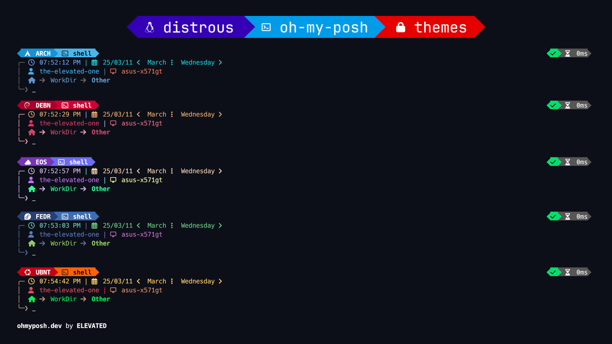

# My Oh My Posh Distrous Themes

A collection of distribution-specific themes for Oh My Posh, designed to automatically switch based on the current OS or container environment.

## Features

- **Auto-Detection:** Automatically switches themes based on `/etc/os-release`.
- **Distrobox/Container Support:** Shows a container icon (`\uf4b7`) when running inside a container.
- **Support for 30+ Distros:** Includes themes for Arch, Fedora, Debian, Ubuntu, Alpine, and many more.
- **Easy Installation:** Single script to set up themes and update your `.bashrc`.

## Example



## Installation

1. Clone this repository:
   ```bash
   git clone git@github.com:maxfridbe/my-omp-distrous.git ~/dev/my-omp-distrous
   ```

2. Run the installer:
   ```bash
   cd ~/dev/my-omp-distrous
   ./install.sh
   ```

3. Restart your shell or source your bashrc:
   ```bash
   source ~/.bashrc
   ```

## How it Works

The `install.sh` script:
1. Copies all themes to `~/.config/omp/themes/`.
2. Appends a specialized logic block to your `~/.bashrc` that:
   - Detects the current OS using `$ID` from `/etc/os-release`.
   - Maps that ID to a specific theme file.
   - Initializes Oh My Posh with the selected theme.
   - Falls back to a general Linux theme if the specific one isn't found.

## Themes included

The themes are stored in the `themes/` directory as `.omp.json` files. Each theme is customized with icons and colors matching its respective distribution.
